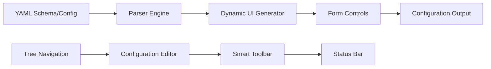

# ConfigCraft 🛠️

<div align="center">

**Universal Visual Configuration Management Tool**  
*Transform complex configuration files into user-friendly GUI interfaces*

[](https://opensource.org/licenses/MIT)
[](https://golang.org)
[](https://github.com/ConfigCraft/configcraft)
[](https://github.com/ConfigCraft/configcraft/releases)

[English](#english) | [中文](#chinese)

</div>

## English

### 🚀 What is ConfigCraft?

ConfigCraft is a powerful, schema-driven configuration management tool that transforms complex YAML configurations into intuitive graphical interfaces. Originally developed for firmware configuration management, it has evolved into a universal solution suitable for any structured configuration workflow.

**Key Features:**
- 📊 **Schema-Driven UI**: Automatically generates forms based on YAML schemas
- 🎯 **Universal Support**: Works with any YAML-based configuration structure
- 🖥️ **Native Experience**: Beautiful cross-platform GUI with native file dialogs
- 🔄 **Dual Output**: Maintains YAML configs while generating custom output formats
- ⚡ **Zero Learning Curve**: Intuitive interface requires no technical knowledge
- 🎨 **Modern Design**: Clean, professional interface with intelligent status display

### 🏗️ Architecture



**Core Components:**
- **Dynamic UI Generation**: Creates form controls based on field types (`select`, `combo`, `number`, `boolean`, `text`)
- **Schema Intelligence**: Auto-detects schema files vs. configuration files
- **Custom Tree Control**: Eliminates GUI framework limitations with smooth navigation
- **Native File Dialogs**: Windows-native file selection with proper path handling
- **Smart Status Bar**: Shows current file path and version information

### 🎯 Use Cases

- **Firmware Configuration**: Hardware parameter management with visual validation
- **Application Settings**: Convert complex config files into user-friendly forms  
- **DevOps Tools**: Simplify deployment configuration for non-technical users
- **Configuration Templates**: Create reusable configuration patterns
- **Multi-Format Output**: Generate various configuration formats from single source

### 🚀 Quick Start

#### Prerequisites
- **Windows 10/11** (primary platform)
- **Go 1.21+** (for building from source)
- **TDM-GCC 10.3.0** (for CGO compilation)

#### Installation

**Option 1: Download Release**
```bash
# Download latest release from GitHub
curl -LO https://github.com/ConfigCraft/configcraft/releases/latest/download/configcraft.exe
```

**Option 2: Build from Source**
```bash
# Clone repository
git clone https://github.com/ConfigCraft/configcraft.git
cd configcraft

# Quick setup (recommended)
make build

# Or using provided script
build\build.bat

# Or build manually
go build -ldflags "-s -w -H windowsgui" -o build\configcraft.exe main.go
```

#### Basic Usage

1. **Launch Application**
   ```bash
   # Run GUI version
   .\build\configcraft.exe
   
   # Or CLI version for automation
   cd cmd && go run cli.go
   ```

2. **Load Configuration**
   - Click "打开配置" to select a YAML file
   - ConfigCraft auto-detects schema vs. configuration files
   - Navigate sections using the left panel tree

3. **Edit Settings**
   - Select configuration groups from the tree navigation
   - Modify values using generated form controls
   - View real-time validation and help information

4. **Save Results**
   - Click "保存配置" to save changes
   - Generates both YAML config and custom output format
   - Files saved with consistent naming: `config.yaml` + `config.conf`

### 📁 Project Structure

```
configcraft/
├── internal/
│   ├── version/           # Version management
│   ├── config/           # Parser and generator engine  
│   ├── models/           # Data structures and types
│   └── ui/               # GUI components and logic
│       └── components/   # Custom UI controls
├── assets/schemas/       # Example schema files
├── build/               # Build artifacts and scripts
├── docs/                # Additional documentation
├── cmd/                 # CLI version
└── main.go              # Application entry point
```

### 🛠️ Configuration Schema Format

ConfigCraft uses YAML schemas to define configuration structure:

```yaml
sections:
  section_name:
    name: "Display Name"
    groups:
      group_name:
        name: "Group Display Name"
        fields:
          field_name:
            type: "select"  # select, combo, number, boolean, text
            label: "Field Label"
            description: "Help text shown below field"
            tooltip: "Detailed information in popup"
            placeholder: "Input hint text"
            options:
              - value: "option1"
                label: "Option 1"
              - value: "option2" 
                label: "Option 2"
            default: "option1"
            required: true
```

**Supported Field Types:**
- `select`: Dropdown with predefined options
- `combo`: Editable dropdown (preset + custom input)
- `number`: Numeric input with validation
- `boolean`: Checkbox control
- `text`: Free-form text entry

### 🎨 Technical Highlights

- **Custom Tree Navigation**: Solves Fyne framework tree flickering with VBox-based implementation
- **Native File Dialogs**: Integrates zenity library for Windows-native file selection
- **Intelligent Path Display**: Shows relative paths with smart truncation (max 2 levels)
- **Version Synchronization**: Centralized version management across all UI elements
- **Schema-Driven Architecture**: Zero-configuration UI generation from YAML definitions
- **Cross-Platform Foundation**: Built with Go and Fyne for future platform expansion

### 🔧 Development

#### Setting Up Development Environment

```bash
# Clone and setup
git clone https://github.com/ConfigCraft/configcraft.git
cd configcraft

# Install dependencies and setup
make deps

# Run in development mode  
make dev

# Run tests
make test
```

#### Key Development Guidelines

- **Version Updates**: Modify only `internal/version/version.go`
- **UI Components**: Follow existing patterns in `internal/ui/components/`
- **Configuration Logic**: Extend `internal/config/parser.go` for new formats
- **Error Handling**: Provide meaningful error messages with context
- **Documentation**: Update relevant docs for any API changes

### 🤝 Contributing

We welcome contributions! Please see our [Contributing Guidelines](CONTRIBUTING.md) for details.

**Quick Contribution Steps:**
1. Fork the repository
2. Create a feature branch (`git checkout -b feature/amazing-feature`)
3. Commit changes (`git commit -m 'Add amazing feature'`)
4. Push to branch (`git push origin feature/amazing-feature`)  
5. Open a Pull Request

**Areas Where Help is Needed:**
- [ ] Cross-platform testing and support
- [ ] Additional configuration format support
- [ ] Performance optimization for large configs
- [ ] Advanced validation features
- [ ] Internationalization (i18n)

### 📄 License

This project is licensed under the MIT License - see the [LICENSE](LICENSE) file for details.

### 🙏 Acknowledgments

- **Fyne Framework**: Cross-platform GUI development
- **Zenity Library**: Native dialog integration
- **Go Community**: Excellent tooling and ecosystem
- **All Contributors**: Thank you for making ConfigCraft better!

---

## Chinese

### 🚀 ConfigCraft 是什么？

ConfigCraft 是一款强大的配置管理可视化工具，将复杂的YAML配置文件转换为直观的图形化界面。最初为固件配置管理而开发，现已演化为适用于任何结构化配置工作流程的通用解决方案。

**核心特性：**
- 📊 **Schema驱动界面**：根据YAML结构自动生成表单控件
- 🎯 **通用支持**：适用于任何基于YAML的配置结构  
- 🖥️ **原生体验**：精美的跨平台GUI界面，原生文件对话框
- 🔄 **双重输出**：维护YAML配置的同时生成自定义格式文件
- ⚡ **零学习成本**：直观界面无需技术背景
- 🎨 **现代设计**：简洁专业的界面设计，智能状态显示

### 🎯 应用场景

- **固件配置管理**：硬件参数可视化配置与验证
- **应用程序设置**：将复杂配置文件转换为用户友好的表单
- **DevOps工具**：为非技术用户简化部署配置
- **配置模板系统**：创建可重用的配置模式
- **多格式输出**：从单一源文件生成多种配置格式

### 🚀 快速开始

#### 环境要求
- **Windows 10/11**（主要平台）
- **Go 1.21+**（从源码构建需要）
- **TDM-GCC 10.3.0**（CGO编译需要）

#### 安装方式

**方式一：下载发布版本**
```bash
# 从GitHub下载最新版本
curl -LO https://github.com/ConfigCraft/configcraft/releases/latest/download/configcraft.exe
```

**方式二：源码构建**
```bash
# 克隆仓库
git clone https://github.com/ConfigCraft/configcraft.git
cd configcraft

# 快速构建（推荐）
make build

# 或使用构建脚本
build\build.bat

# 或手动构建
go build -ldflags "-s -w -H windowsgui" -o build\configcraft.exe main.go
```

#### 基本使用

1. **启动应用程序**
   ```bash
   # 运行GUI版本
   .\build\configcraft.exe
   
   # 或运行CLI版本（用于自动化）
   cd cmd && go run cli.go
   ```

2. **加载配置文件**
   - 点击"打开配置"选择YAML文件
   - ConfigCraft自动识别schema文件与配置文件
   - 使用左侧树形导航浏览配置分组

3. **编辑配置**
   - 从树形导航选择配置分组
   - 使用生成的表单控件修改数值
   - 查看实时验证和帮助信息

4. **保存结果**
   - 点击"保存配置"保存更改
   - 同时生成YAML配置文件和自定义输出格式
   - 文件命名保持一致：`config.yaml` + `config.conf`

### 🔧 开发指南

#### 开发环境搭建

```bash
# 克隆并设置项目
git clone https://github.com/ConfigCraft/configcraft.git
cd configcraft

# 安装依赖和设置
make deps

# 开发模式运行
make dev

# 运行测试
make test
```

#### 关键开发准则

- **版本更新**：仅修改 `internal/version/version.go`
- **UI组件**：遵循 `internal/ui/components/` 中的现有模式
- **配置逻辑**：在 `internal/config/parser.go` 中扩展新格式支持
- **错误处理**：提供有意义的错误信息和上下文
- **文档维护**：为任何API更改更新相关文档

### 🤝 参与贡献

我们欢迎贡献！请查看我们的[贡献指南](CONTRIBUTING.md)了解详情。

**贡献步骤：**
1. Fork 仓库
2. 创建功能分支 (`git checkout -b feature/amazing-feature`)
3. 提交更改 (`git commit -m 'Add amazing feature'`)
4. 推送分支 (`git push origin feature/amazing-feature`)
5. 创建 Pull Request

**需要帮助的领域：**
- [ ] 跨平台测试与支持
- [ ] 附加配置格式支持
- [ ] 大型配置文件性能优化
- [ ] 高级验证功能
- [ ] 国际化支持

### 📊 技术特色

- **自定义树形导航**：解决Fyne框架树形控件闪烁问题，使用VBox实现
- **原生文件对话框**：集成zenity库，提供Windows原生文件选择体验
- **智能路径显示**：相对路径智能截取显示（最多2级目录）
- **版本同步管理**：跨所有UI元素的集中版本管理
- **Schema驱动架构**：从YAML定义零配置生成UI界面
- **跨平台基础**：基于Go和Fyne构建，为未来平台扩展奠定基础

### 📄 许可证

本项目采用 MIT 许可证 - 查看 [LICENSE](LICENSE) 文件了解详情。

### 🙏 致谢

- **Fyne框架**：跨平台GUI开发支持
- **Zenity库**：原生对话框集成
- **Go社区**：优秀的工具链和生态系统
- **所有贡献者**：感谢让ConfigCraft变得更好！

---

<div align="center">

**🌟 如果这个项目对您有帮助，请给我们一个Star！**

[🐛 报告问题](https://github.com/ConfigCraft/configcraft/issues) | 
[💡 功能请求](https://github.com/ConfigCraft/configcraft/issues) | 
[📖 文档](https://github.com/ConfigCraft/configcraft/wiki) |
[🔄 更新日志](./CHANGELOG.md)

*ConfigCraft - 让配置管理变得简单高效* 

</div>