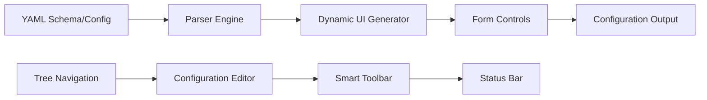

# ConfigCraft 🛠️

<div align="center">

**Universal Visual Configuration Management Tool**  
*Transform complex configuration files into user-friendly GUI interfaces*

[](https://opensource.org/licenses/MIT)
[](https://golang.org)
[](https://github.com/ConfigCraft/configcraft)
[](https://github.com/ConfigCraft/configcraft/releases)

**English** | [中文](README.zh.md)

</div>

## 🚀 What is ConfigCraft?

ConfigCraft is a powerful, schema-driven configuration management tool that transforms complex YAML configurations into intuitive graphical interfaces. Originally developed for firmware configuration management, it has evolved into a universal solution suitable for any structured configuration workflow.

**Key Features:**
- 📊 **Schema-Driven UI**: Automatically generates forms based on YAML schemas
- 🎯 **Universal Support**: Works with any YAML-based configuration structure
- 🖥️ **Native Experience**: Beautiful cross-platform GUI with native file dialogs
- 🔄 **Dual Output**: Maintains YAML configs while generating custom output formats
- ⚡ **Zero Learning Curve**: Intuitive interface requires no technical knowledge
- 🎨 **Modern Design**: Clean, professional interface with intelligent status display

## 🏗️ Architecture



**Core Components:**
- **Dynamic UI Generation**: Creates form controls based on field types (`select`, `combo`, `number`, `boolean`, `text`)
- **Schema Intelligence**: Auto-detects schema files vs. configuration files
- **Custom Tree Control**: Eliminates GUI framework limitations with smooth navigation
- **Native File Dialogs**: Windows-native file selection with proper path handling
- **Smart Status Bar**: Shows current file path and version information

## 🎯 Use Cases

- **Firmware Configuration**: Hardware parameter management with visual validation
- **Application Settings**: Convert complex config files into user-friendly forms  
- **DevOps Tools**: Simplify deployment configuration for non-technical users
- **Configuration Templates**: Create reusable configuration patterns
- **Multi-Format Output**: Generate various configuration formats from single source

## 🚀 Quick Start

### Prerequisites
- **Windows 10/11** (primary platform)
- **Go 1.21+** (for building from source)
- **TDM-GCC 10.3.0** (for CGO compilation)

### Installation

**Option 1: Download Release**
```bash
# Download latest release from GitHub
curl -LO https://github.com/ConfigCraft/configcraft/releases/latest/download/configcraft.exe
```

**Option 2: Build from Source**
```bash
# Clone repository
git clone https://github.com/ConfigCraft/configcraft.git
cd configcraft

# Quick setup (recommended)
make build

# Or using provided script
build\build.bat

# Or build manually
go build -ldflags "-s -w -H windowsgui" -o build\configcraft.exe main.go
```

### Basic Usage

1. **Launch Application**
   ```bash
   # Run GUI version
   .\build\configcraft.exe
   
   # Or CLI version for automation
   cd cmd && go run cli.go
   ```

2. **Load Configuration**
   - Click "打开配置" to select a YAML file
   - ConfigCraft auto-detects schema vs. configuration files
   - Navigate sections using the left panel tree

3. **Edit Settings**
   - Select configuration groups from the tree navigation
   - Modify values using generated form controls
   - View real-time validation and help information

4. **Save Results**
   - Click "保存配置" to save changes
   - Generates both YAML config and custom output format
   - Files saved with consistent naming: `config.yaml` + `config.conf`

## 📁 Project Structure

```
configcraft/
├── internal/
│   ├── version/           # Version management
│   ├── config/           # Parser and generator engine  
│   ├── models/           # Data structures and types
│   └── ui/               # GUI components and logic
│       └── components/   # Custom UI controls
├── assets/schemas/       # Example schema files
├── build/               # Build artifacts and scripts
├── docs/                # Additional documentation
├── cmd/                 # CLI version
└── main.go              # Application entry point
```

## 🛠️ Configuration Schema Format

ConfigCraft uses YAML schemas to define configuration structure:

```yaml
sections:
  section_name:
    name: "Display Name"
    groups:
      group_name:
        name: "Group Display Name"
        fields:
          field_name:
            type: "select"  # select, combo, number, boolean, text
            label: "Field Label"
            description: "Help text shown below field"
            tooltip: "Detailed information in popup"
            placeholder: "Input hint text"
            options:
              - value: "option1"
                label: "Option 1"
              - value: "option2" 
                label: "Option 2"
            default: "option1"
            required: true
```

**Supported Field Types:**
- `select`: Dropdown with predefined options
- `combo`: Editable dropdown (preset + custom input)
- `number`: Numeric input with validation
- `boolean`: Checkbox control
- `text`: Free-form text entry

## 🎨 Technical Highlights

- **Custom Tree Navigation**: Solves Fyne framework tree flickering with VBox-based implementation
- **Native File Dialogs**: Integrates zenity library for Windows-native file selection
- **Intelligent Path Display**: Shows relative paths with smart truncation (max 2 levels)
- **Version Synchronization**: Centralized version management across all UI elements
- **Schema-Driven Architecture**: Zero-configuration UI generation from YAML definitions
- **Cross-Platform Foundation**: Built with Go and Fyne for future platform expansion

## 🔧 Development

### Setting Up Development Environment

```bash
# Clone and setup
git clone https://github.com/ConfigCraft/configcraft.git
cd configcraft

# Install dependencies and setup
make deps

# Run in development mode  
make dev

# Run tests
make test
```

### Key Development Guidelines

- **Version Updates**: Modify only `internal/version/version.go`
- **UI Components**: Follow existing patterns in `internal/ui/components/`
- **Configuration Logic**: Extend `internal/config/parser.go` for new formats
- **Error Handling**: Provide meaningful error messages with context
- **Documentation**: Update relevant docs for any API changes

## 🤝 Contributing

We welcome contributions! Please see our [Contributing Guidelines](CONTRIBUTING.md) for details.

**Quick Contribution Steps:**
1. Fork the repository
2. Create a feature branch (`git checkout -b feature/amazing-feature`)
3. Commit changes (`git commit -m 'Add amazing feature'`)
4. Push to branch (`git push origin feature/amazing-feature`)  
5. Open a Pull Request

**Areas Where Help is Needed:**
- [ ] Cross-platform testing and support
- [ ] Additional configuration format support
- [ ] Performance optimization for large configs
- [ ] Advanced validation features
- [ ] Internationalization (i18n)

## 📄 License

This project is licensed under the MIT License - see the [LICENSE](LICENSE) file for details.

## 🙏 Acknowledgments

- **Fyne Framework**: Cross-platform GUI development
- **Zenity Library**: Native dialog integration
- **Go Community**: Excellent tooling and ecosystem
- **All Contributors**: Thank you for making ConfigCraft better!

---

<div align="center">

**🌟 If this project helps you, please give us a Star!**

[🐛 Report Issues](https://github.com/ConfigCraft/configcraft/issues) | 
[💡 Feature Requests](https://github.com/ConfigCraft/configcraft/issues) | 
[📖 Documentation](https://github.com/ConfigCraft/configcraft/wiki) |
[🔄 Changelog](./CHANGELOG.md)

*ConfigCraft - Making configuration management simple and efficient* 

</div>